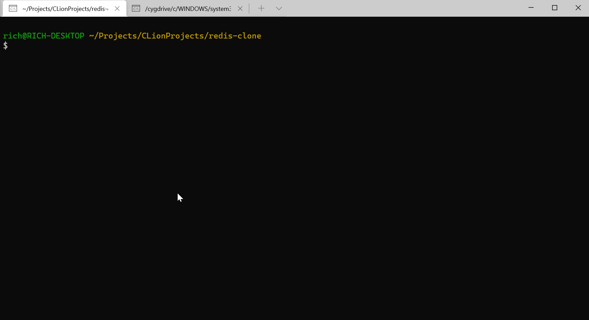

# Rust Redis Clone

Implemented 

- [x] MONITOR
- [x] QUIT
- [x] PING
- [x] COMMAND
- [x] SET 
- [x] GET
- [x] DEL
- [x] KEYS
- [x] MSET
- [x] MGET
- [x] GETDEL
- [x] GETSET
- [ ] LPUSH
- [ ] LPOP
- [ ] RPUSH
- [ ] RPOP
- [ ] LLEN
- [ ] BLPOP

